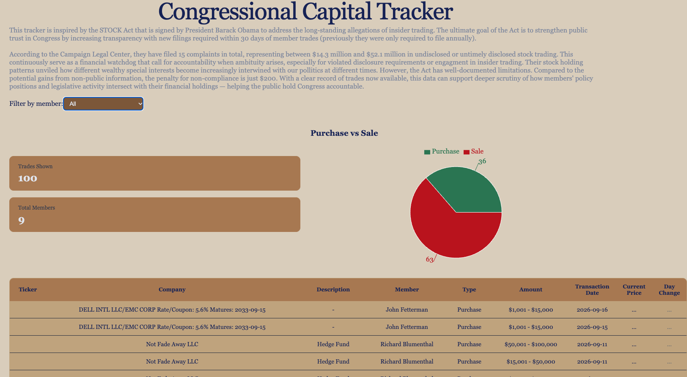
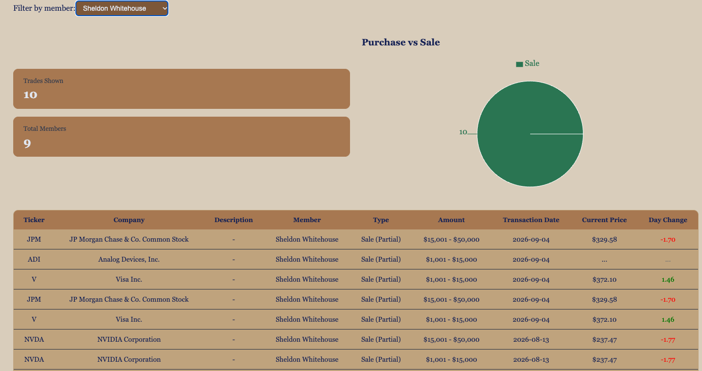

# Congressional Capital Tracker

**🔗 Live Demo: [capitaltracker-ruddy.vercel.app](https://capitaltracker-ruddy.vercel.app/)**

A transparency dashboard for U.S. congressional stock trades, with live prices and day changes.




## What It Does

Members of Congress have access to non-public information that opportunists could exploit while serving in public office. Effective public scrutiny helps close that information gap and lets citizens monitor how legislators' financial activity intersects with their policy roles.

Capital Tracker surfaces publicly disclosed stock trades made by members of the U.S. Senate (filed under the STOCK Act) and pairs each trade with live market prices. Users can browse the latest trades across all members, filter to a specific senator, and see a breakdown of their buy/sell activity.

## Why I Built It

After years in institutional consulting and financial services, I repeatedly saw how reluctant organizations can be to disclose conflicts of interest — and how much that opacity can cost the public. That concern carried over as I transitioned into software engineering. I wanted a project that combined real public-interest data with the API-integration and data-handling challenges that production apps actually face. The congressional-trades domain let me apply my financial-data instincts while learning modern React.

## Features

1. **Individual-level filter** — drill into a single senator's disclosed trades.
   - Stops API calls when "All" members are selected, to preserve quota.
2. **Live trade feed & market prices** — the most recent Senate trades, pulled from a real financial-data API, with current prices and day change layered onto each holding.
   - Batches price calls when a member is selected, and fetches duplicate tickers only once.
3. **Allocation chart** — a visual buy/sell breakdown (using Recharts).
4. **Graceful handling of data issues** — displays loading, error, and empty states, and parses messy disclosure text into clean fields.

## Tech Stack

- **Frontend:** React, TypeScript, Vite
- **Charts:** Recharts
- **Data:** Financial Modeling Prep API (Senate trades, Batch Quote Short)
- **Deployment:** Vercel

## Architecture Notes

- **Two-source data design:** A primary API call fetches all disclosed trades; a second fetches live prices only for the symbols currently in view, to stay within free-tier rate limits.
- **Quota-aware fetching:** Prices are only requested when a specific member is selected (not for the full feed), deliberately trading completeness for API-budget efficiency.
- **Defensive data parsing:** Disclosure descriptions arrive in several inconsistent formats; the app parses the company name and description out of them and falls back gracefully when a format doesn't match.

## Known Limitations

- Live prices are available only for the symbols included in the data provider's free tier; others display "…". Some transactions don't return valid ticker data when the instrument is private debt or a secondary trade.
  - The FMP quote API only makes prices available for a set of top trending tickers on the free plan.
- The free API tier caps daily requests, so heavy use may temporarily exhaust the quota and return a 429 status code.

## Running Locally

```bash
# Clone and install
git clone https://github.com/gulgicheese/Portfolio.git
cd Portfolio
npm install

# Add your API key
echo "VITE_FMP_KEY=your_key_here" > .env

# Run
npm run dev
```

Get a free API key at [Financial Modeling Prep](https://site.financialmodelingprep.com).

## What I Learned

- Writing type-safe React with TypeScript — using types as data contracts to catch bugs before runtime.
- Fetching and synchronizing two data sources with `useEffect` and dependency arrays.
- Handling genuinely messy real-world data rather than clean sample data.

### Next Steps

- A backend layer (caching + key security)
- Per-member historical performance
- More complete price coverage via a different data provider

---
